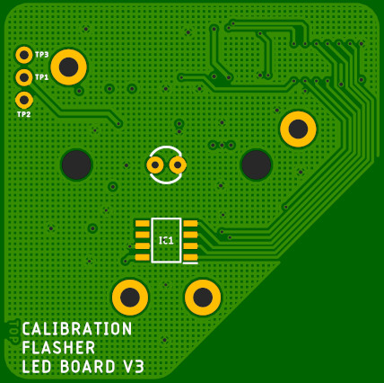

# Nanosecond LED Flasher Shield: Hardware Overview

A nanosecond LED flasher board which provides digital control of both pulse width and LED current. Designed to aid
photomultiplier detector calibration and characterisation.

The full schematic is available [here](../Hardware/Flasher_LED_Board_V3.pdf).

## LMG1025

The LED is driven by the new [LMG1025 from Texas Instruments](http://www.ti.com/product/LMG1025-Q1).
Designed for automotive LIDAR applications, this gate driver has typical rise and fall times of 650ps
and 850ps and can produce 5V pulse widths as short as 1.25ns.

The functional block diagram for the LMG1025 is:

The LMG1025 is designed to drive a GaN FET to switch a LIDAR source, but with pull-up and pull-down
current limits of 7A and 5A it can of course drive a standard or high-brightness LED directly.

The truth table for the LMG1025 is:

It is important to note that OUTH is pulled up to 5V only when IN+ is high and IN- is low. In each of the other
three possible states, OUTL is pulled low. We can take advantage of this by connecting OUTH to the current-limiting
resistor and OUTL directly to the LED anode. This allows the LED to be turned off very quickly.

## DS1023

The Maxim Integrated DS1023S-25+ is a programmable timing element with two outputs: OUT and REF. The delay between IN and
OUT is digitally-programmable from 0ns to ~64ns in 256 0.25ns increments. There is also an additional inherent "step zero"
delay between IN and OUT caused by the propagation delay through the chip. The REF output is delayed by a small fixed delay
of approximately 1.5ns plus the same "step zero" delay. By driving the LMG1025 IN+ and IN- from REF and OUT respectively,
the LED pulse can be adjusted from essentially zero pulse width (+/-0.125ns) to a maximum of 62.5ns (64ns - 1.5ns).
The LED turns on when REF goes high, and off again when OUT goes high.

## Photorelays

Five resistors, connected in series, are connected between the LMG1025 OUTH pin and the LED anode. By shorting out four
of these resistors in 16 permutations, the LED current can be adjusted between minimum and maximum values dictated by
the selection of resistor values. The resistors are shorted out by TLP3475 photorelays which provide fast response times
and an on-resistance of approximately 1ohm.

For example: with resistances of 10, 18, 22, 27 and 33 ohms, with the 10 ohm resistor always in circuit, it is possible to achieve
an even spread of resistance values from 13.8 ohms to 110 ohms.

## ADT7310

The temperature can be measured via an [ADT7310 16-bit SPI temperature sensor](https://www.analog.com/en/products/adt7310.html).

## DS28CM00

The board is also equipped with a [DS28CM00 I2C silicon serial number](https://www.maximintegrated.com/en/products/ibutton-one-wire/memory-products/DS28CM00.html)
to allow the board to be uniquely identified during calibration.

## Connector

The connector is a [Samtec FW-08-05]

The pin allocation is:
- 1: +5V power
- 2: GND (0V)
- 3: I2C SDA (DS28CM00)
- 4: SPI SCK (ADT7310)
- 5: I2C SCL (DS28CM00)
- 6: SPI CIPO (ADT7310)
- 7: Photorelay A2
- 8: SPI COPI (ADT7310)
- 9: Photorelay A1
- 10: SPI CS (ADT7310)
- 11: Photorelay A0
- 12: DS1023 Data
- 13: Photorelay A3
- 14: DS1023 CLK
- 15: Trigger signal
- 16: DS1023 Latch Enable

## TXB0108

To minimise congestion on the matching controller board, all I/O signals from the controller board to the LED board are 3.3V.
However, the DS1023 is of course a 5V device. A [TXB0108](https://www.ti.com/product/TXB0108) 8-bit bidirectional voltage-level shifter
converts the 3.3V signals to 5V.

## ThorLabs S1LEDM SM1

To aid the mounting of a diffuser or fibre-coupling optics, a modified [ThorLabs S1LEDM SM1 threaded mount](https://www.thorlabs.de/thorproduct.cfm?partnumber=S1LEDM)
can be mounted onto the circuit board.

It is necessary to:
- drill and tap the two spanner wrench slots to M3.0
  - the wrench slots are separated by 20.32mm in X
- mill a recess/pocket for the ADT7310
  - the pocket needs to be:
    - 8mm x 6mm
    - with a corner (tool) radius of 1mm
    - offset by 8.50mm in Y from the center of the part

