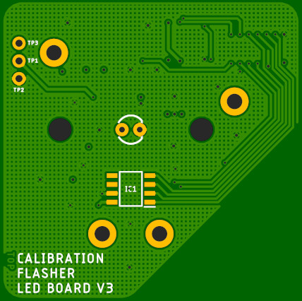
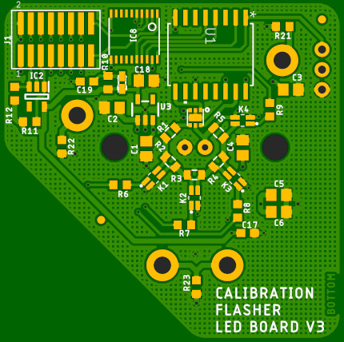

# CTA Calibration Flasher: LED Board V3

A nanosecond LED flasher board which provides digital control of both pulse width and LED current. Designed to aid
photomultiplier detector calibration and characterisation.

The design of this board is based extensively on that of the [Nanosecond LED Flasher Shield](https://github.com/PaulZC/Nanosecond_LED_Flasher_Shield).

The LED is driven by the [LMG1025 from Texas Instruments](http://www.ti.com/product/LMG1025-Q1).
Designed for automotive LIDAR applications, this gate driver has typical rise and fall times of 650ps
and 850ps and can produce 5V pulse widths as short as 1.25ns.

The pulse width is controlled by a [Maxim Integrated DS1023S-25+](https://www.maximintegrated.com/en/products/analog/clock-generation-distribution/DS1023.html)
programmable timing element which can produce digitally-adjustable pulse widths of 0 to ~64ns in 0.25ns increments.

The LED current is set by five surface mount resistors connected in series, four of which can be shorted
out by [Toshiba TLP3475 photorelays](https://toshiba.semicon-storage.com/ap-en/semiconductor/product/optoelectronics/photorelay-mosfet-output/detail.TLP3475.html)
allowing the LED current to be adjusted digitally in 16 increments.

The board is designed to be mounted on and controlled by the [CTA Calibration Flasher Controller Board V3](https://github.com/PaulZC/CTA_Calibration_Flasher_Controller_Board_V3).

The temperature can be measured via an [ADT7310 16-bit SPI temperature sensor](https://www.analog.com/en/products/adt7310.html).

The board is also equipped with a [DS28CM00 I2C silicon serial number](https://www.maximintegrated.com/en/products/ibutton-one-wire/memory-products/DS28CM00.html)
to allow the board to be uniquely identified during calibration.

To aid the mounting of a diffuser or fibre-coupling optics, a modified [ThorLabs S1LEDM SM1 threaded mount](https://www.thorlabs.de/thorproduct.cfm?partnumber=S1LEDM)
can be mounted onto the circuit board.

Please note that this board requires 5V power but that all I/O signals are 3.3V.

## Repository Contents

- **/Documentation** - Documentation for the hardware
- **/Hardware** - BOM, schematic, Eagle PCB design files and Gerber files
- **LICENSE.md** contains the licence information

## Documentation

- [Hardware overview](./Documentation/README.md): an overview of the hardware

Enjoy!

**_Paul_**
